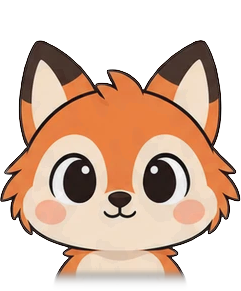
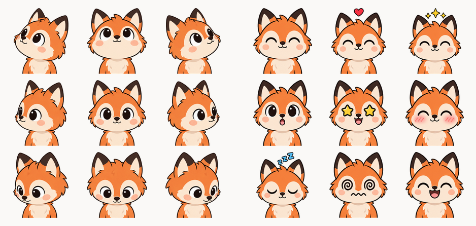
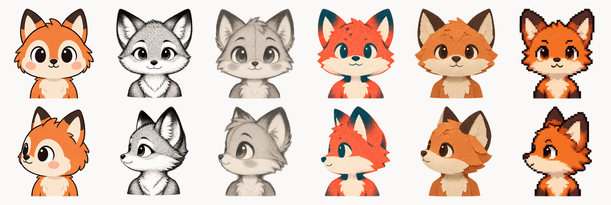

# page-mascot

An interactive character that watches the cursor and blinks when you poke it.

**[See the fifty-two &rarr;](https://koboyo.com/page-mascot)**

## Install

```bash
npm i page-mascot
```

## Use existing mascots

Pick a character on the [demo page](https://koboyo.com/page-mascot) and download its two
sheets into `public/mascots`, then point the component at them:

```tsx
import { Mascot } from 'page-mascot'

<Mascot
  directions="/mascots/fox-directions.webp"
  reactions="/mascots/fox-reactions.webp"
/>
```

The paths are whatever your app serves, so imported images work too.

Give it a named feel with `personality`, or a partial override with `motion`. Omit
both and the mascot behaves as it always has — look-at and boop, no idle.

```tsx
<Mascot
  directions="/mascots/fox-directions.webp"
  reactions="/mascots/fox-reactions.webp"
  personality="bouncy"
/>
```

Or let an agent do it, once the skill below is installed:

```
/page-mascot put the fox on my page
```

## Draw your own

Install the skill:

```bash
npx skills add nilbuild/page-mascot --skill page-mascot --global --yes
```

Then ask your agent:

```
/page-mascot a chibi otter with chocolate-brown fur
/page-mascot make one that looks like me        [attach a photo]
/page-mascot a chibi fox, in the riso style
```

It draws the nine directions and nine expressions, builds them into two aligned sheets,
checks the character does not jump between them, and puts the component on your page, with
the same two props as above.

Drawing needs an image tool. Codex has its own; Claude Code goes through the OpenAI images
API:

```bash
export OPENAI_API_KEY=sk-...
```

Or take the [prompts](skills/page-mascot/reference/prompts.md) and use them in any chat
UI.

## Props

| prop | default | |
| --- | --- | --- |
| `directions` | none | path to the directions sheet |
| `reactions` | none | path to the reactions sheet |
| `size` | `140` | px, square |
| `label` | `'mascot'` | what a screen reader calls it |
| `className` | | |
| `personality` | | named profile: `calm`, `bouncy`, `shy`, or `hyper` |
| `motion` | | partial motion override; wins over the named profile |

| profile | feel |
| --- | --- |
| `calm` | larger dead zone, slower boop, soft squash, sparse centered blinks |
| `bouncy` | snappier squash, shorter boop, delighted/sparkle payoffs, idle on |
| `shy` | high hysteresis, bashful/wink heavy, gentle squash, rare idle |
| `hyper` | small dead zone, fast boop, dizzy sooner, frequent idle sparkles |

Omitting `personality` and `motion` keeps the prior default: same look-at and boop
timings, squash on, idle off.

Tracking switches off without a fine pointer. Squash is skipped when
`prefers-reduced-motion: reduce` is set. Idle is skipped in that case too when
`idle.respectReducedMotion` is true (the default).

## How it works

Each character is two 3×3 sprite sheets: nine head directions, and nine expressions.



The pointer's angle picks a cell on the directions sheet, with a dead zone so the head
settles when the cursor is close. A click shows a cell from the reactions sheet, then a
payoff. Named personalities and the `motion` prop only change those timings and which
expressions can idle — the sheets stay the same.

The same character can be drawn in six styles: colour, ink, sketch, riso, paper and pixel.
Only the rendering changes, so the alignment holds.



## License

MIT © [Kamran Ahmed](https://kamran.fyi)
